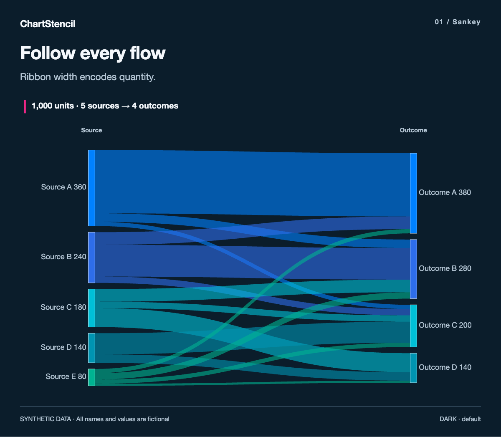
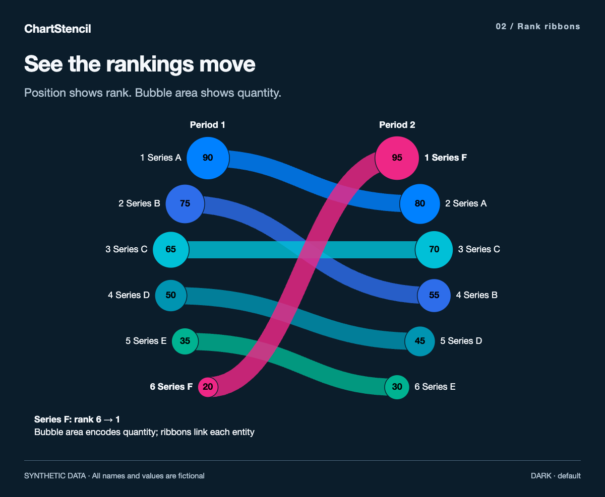
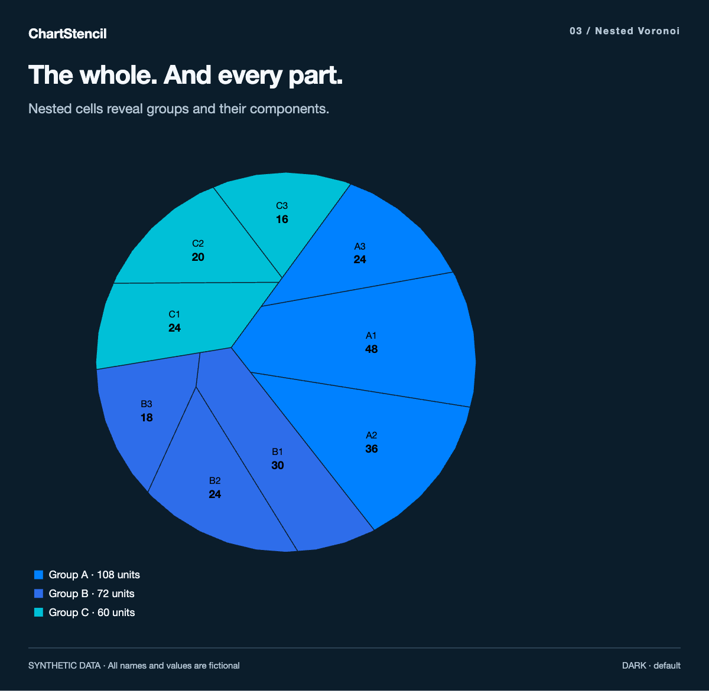
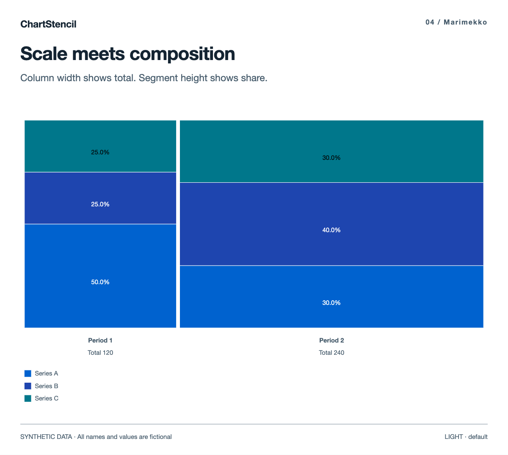
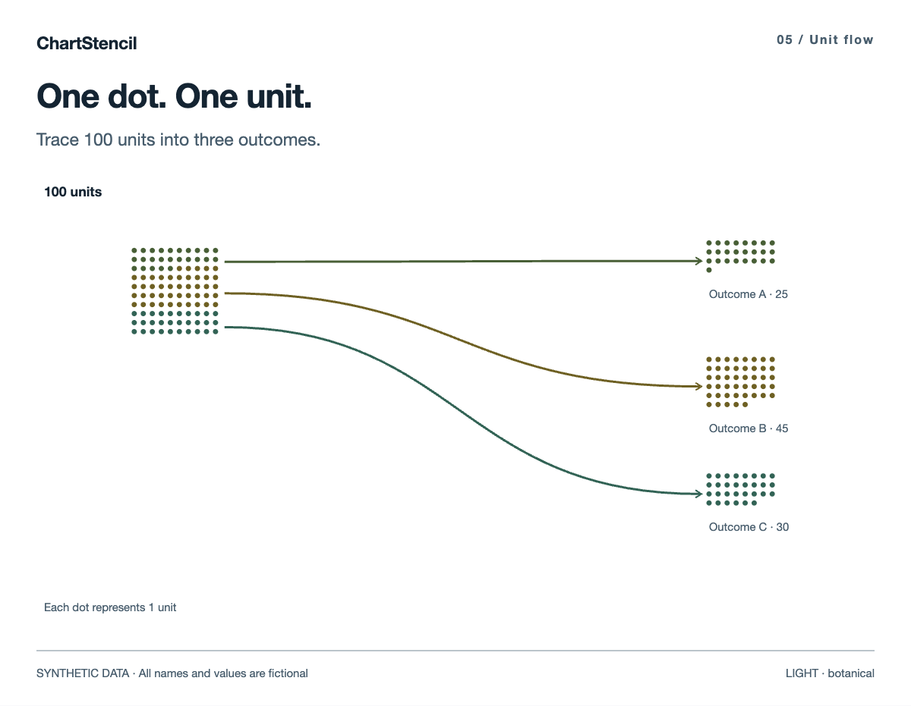
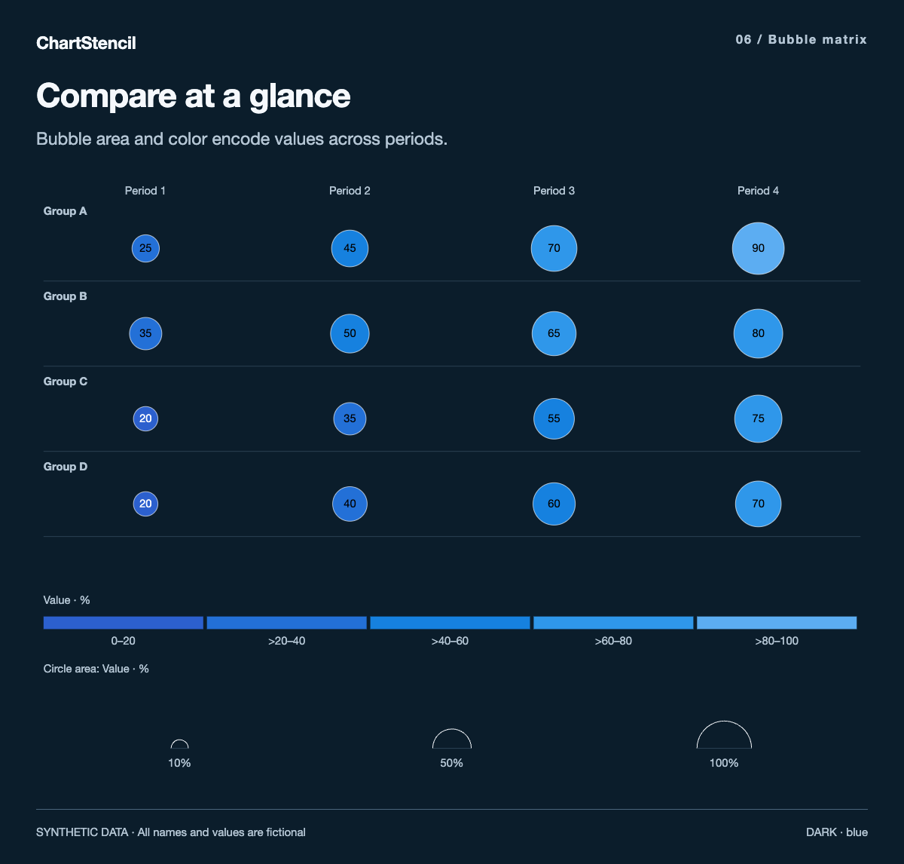
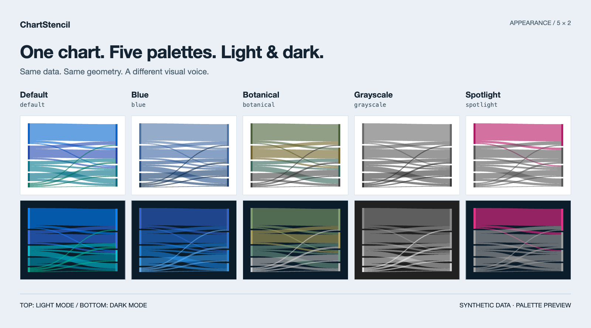

<div align="center">

# ChartStencil

### Consulting-style charts, ready for your data.

A reusable chart skill and local rendering toolkit.<br>
Bring your data and labels. Choose a chart. Export a result you can edit.

**English** · [简体中文](README.zh-CN.md)

[Download](https://github.com/leoshenzh/chartstencil/releases/latest) · [Quick start](#quick-start) · [Chart gallery](#chart-gallery) · [All 119 charts](references/chart-catalog.md)

**119 chart types · 5 palettes · Light & dark · Offline HTML · Editable SVG**

</div>

[](docs/images/sankey-en.png)

**Sankey** — follow every flow, with ribbon widths proportional to quantity.

> Every preview on this page uses **fictional names and synthetic data**. The gallery demonstrates the renderer; it is not a dataset or a business report. Click any image to see it at full size.

## Why ChartStencil

AI assistants can write the analysis. Turning supplied data into a clear, carefully styled chart still takes a visual vocabulary, consistent design rules, and a reliable renderer. ChartStencil provides those reusable pieces.

| Choose the right shape | Make it fit | Keep the output |
| --- | --- | --- |
| **119 chart types** for flows, rankings, composition, comparison, distributions, networks, and time series. | **Five palettes and two themes**, with caller-supplied labels, units, and optional brand colors. | **Standalone HTML** for viewing and interaction, plus **editable SVG** for further design work. |

The toolkit supplies chart templates and rendering logic. You supply the numbers, wording, sources, and conclusions. Omitted headings and notes stay blank.

## Chart gallery

Six selected charts from the library. The Sankey above is the first; the remaining five are below.

### 02 / Rank ribbons

Follow the same entities as their positions change. Bubble area shows quantity; vertical position shows rank.

[](docs/images/ribbons-en.png)

### 03 / Nested Voronoi

See the whole and its components together. Outer groups and inner cells reveal a hierarchy through area.

[](docs/images/nested-voronoi-en.png)

### 04 / Marimekko

Compare scale and composition in one view. Column widths show totals; segment heights show shares.

[](docs/images/mekko-en.png)

### 05 / Unit flow

Make a total tangible. Each dot represents one unit, with flows connecting it to an outcome.

[](docs/images/unit-flow-en.png)

### 06 / Bubble matrix

Scan multiple groups across periods. Bubble area and color provide two visual channels for comparison.

[](docs/images/bubble-matrix-en.png)

[Explore the complete chart catalogue →](references/chart-catalog.md)

## Five palettes. Two themes.

Switch the appearance without changing the underlying data. The same Sankey geometry is shown in all ten combinations below: **light on top, dark below**.

[](docs/images/palettes-en.png)

| Palette | CLI value | Character |
| --- | --- | --- |
| Default | `default` | Blue, cyan, green, and magenta categories |
| Blue | `blue` | A restrained blue sequence |
| Botanical | `botanical` | Greens with olive accents |
| Grayscale | `grayscale` | Neutral tones |
| Spotlight | `spotlight` | An accent against neutral categories |

Themes: `dark` and `light`. Optional brand colors accept six-digit hex values; the renderer adjusts contrast. Some chart encodings use their own ordinal or semantic colors. The generated page includes appearance controls and remembers the reader's theme choice.

## Quick start

**Requires Python 3.8+ and a modern browser.** No Python packages to install. D3 is bundled locally; generated charts work offline.

### 1. Get the toolkit

Download and extract [chartstencil-v0.1.0.zip](https://github.com/leoshenzh/chartstencil/releases/download/v0.1.0/chartstencil-v0.1.0.zip), then open a terminal in its folder.

The release ZIP contains the tool only. This repository additionally includes the synthetic preview images used in its documentation.

### 2. Choose a chart and prepare your data

```sh
python3 scripts/build.py --list
```

Create your own JSON file following the selected chart's [input contract](references/catalog.json) and [data-format guide](references/data-format.md).

- Required: `type`, `data`.
- Optional text: `title`, `subtitle`, `description`, `source`, `footnote`.
- Labels, metrics, units, and annotations come from your input.
- Each chart has structural constraints; not every dataset fits every chart.

### 3. Render

```sh
python3 scripts/build.py \
  --input your-data.json \
  --out out \
  --theme dark \
  --palette default
```

Open the generated HTML in your browser. Explore values, switch themes or palettes, replay the animation, and export the chart as SVG.

SVG export contains the **chart geometry**, not the surrounding page title and source text. Save the HTML or take a browser screenshot to retain the complete card.

### Use it as an AI skill

Load the **whole toolkit folder** into an assistant that supports local skills, following that assistant's installation instructions. [SKILL.md](SKILL.md) is the entry point; keep `assets/`, `references/`, `scripts/`, and `vendor/` alongside it.

The skill selects and applies a chart template to supplied content. It does not invent business data, conclusions, or source claims.

### Language

Bilingual data labels use a two-item array: Chinese first, English second. Add `--lang en` to select English labels. This selects supplied text; it does not translate it. The v0.1.0 page controls remain in Chinese.

## What's included

| Component | Purpose |
| --- | --- |
| [SKILL.md](SKILL.md) | Instructions for an AI assistant |
| [Chart catalogue](references/chart-catalog.md) | All 119 types and their implementation files |
| [Input contracts](references/catalog.json) | Field shapes and constraints |
| [Data-format guide](references/data-format.md) | Input conventions |
| [Builder](scripts/build.py) | JSON → standalone HTML |
| [Chart modules](assets/charts) | Reusable rendering implementations |
| [Release notes](RELEASE.md) | Validation performed and its limits |

Geographic maps, business datasets, preset analysis, report/PPT workflows, and private integrations are outside the tool's scope. Documentation images are synthetic illustrations of supported chart types, with no bundled raw demonstration datasets.

## License & attribution

**MIT.** See [LICENSE](LICENSE) and [NOTICE.md](NOTICE.md). D3 is distributed under the [ISC license](vendor/d3/LICENSE). Upstream notices are retained.

ChartStencil is an independent project, with no affiliation with or endorsement by any consulting firm.

<div align="center">

**Pick a shape. Bring your data. Make it clear.**

[Download ChartStencil](https://github.com/leoshenzh/chartstencil/releases/latest) · [Read the Chinese guide](README.zh-CN.md)

</div>
