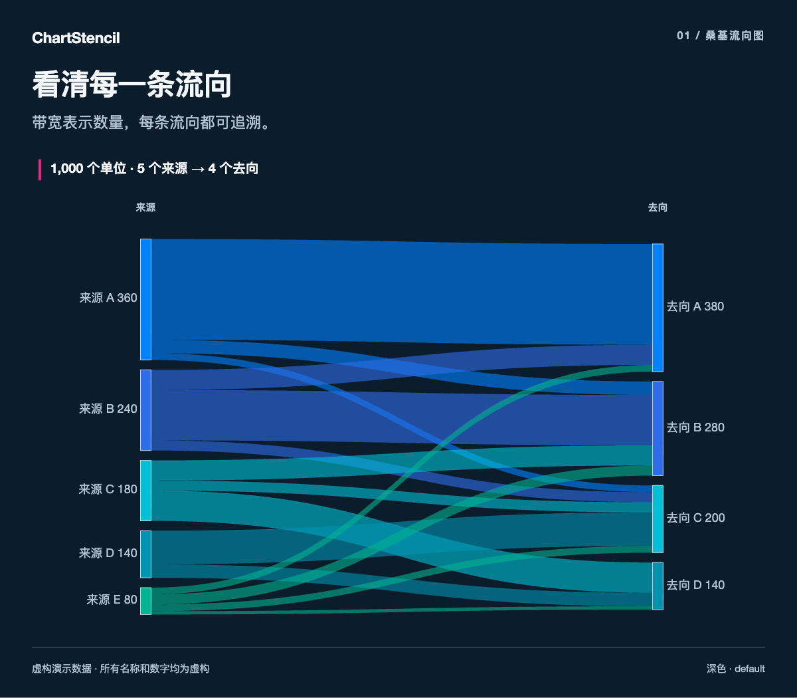
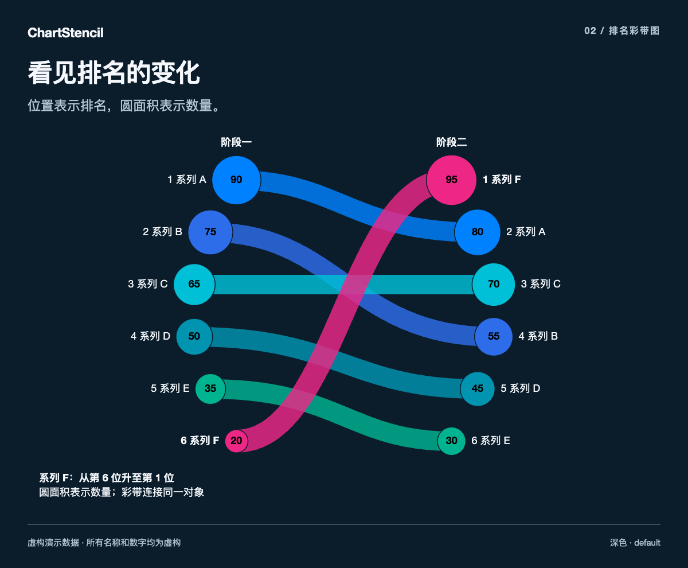
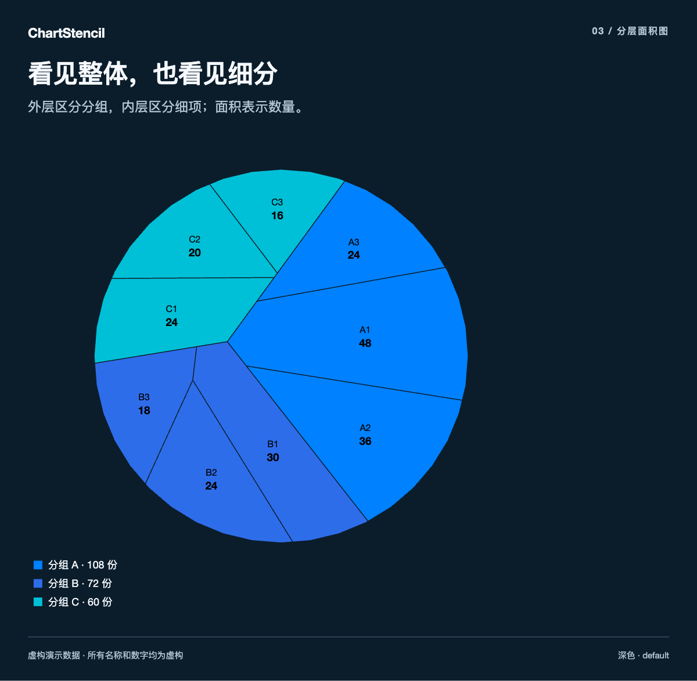
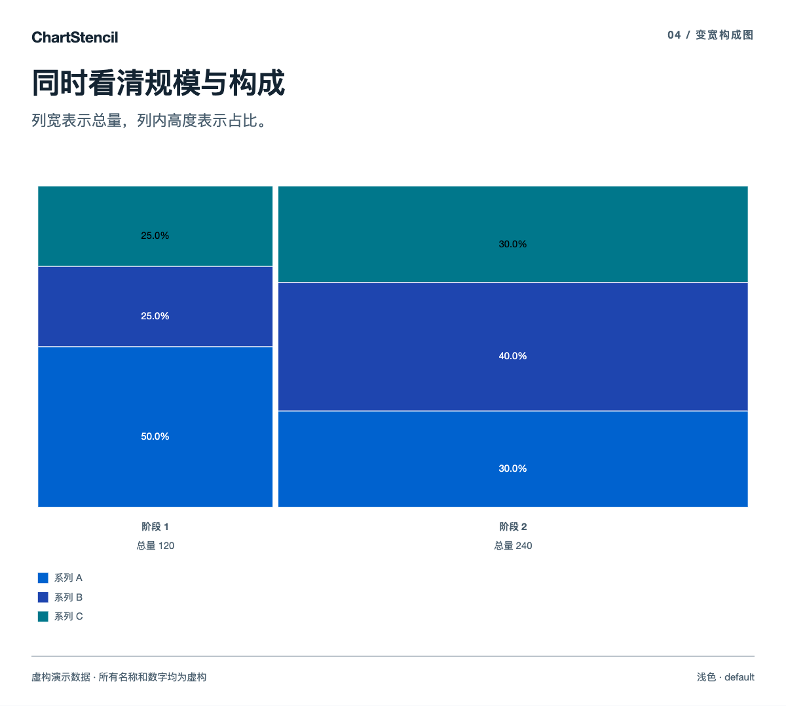
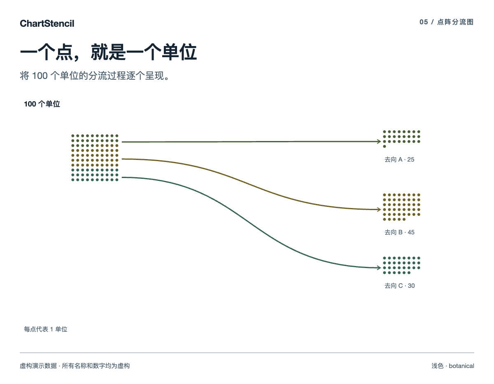
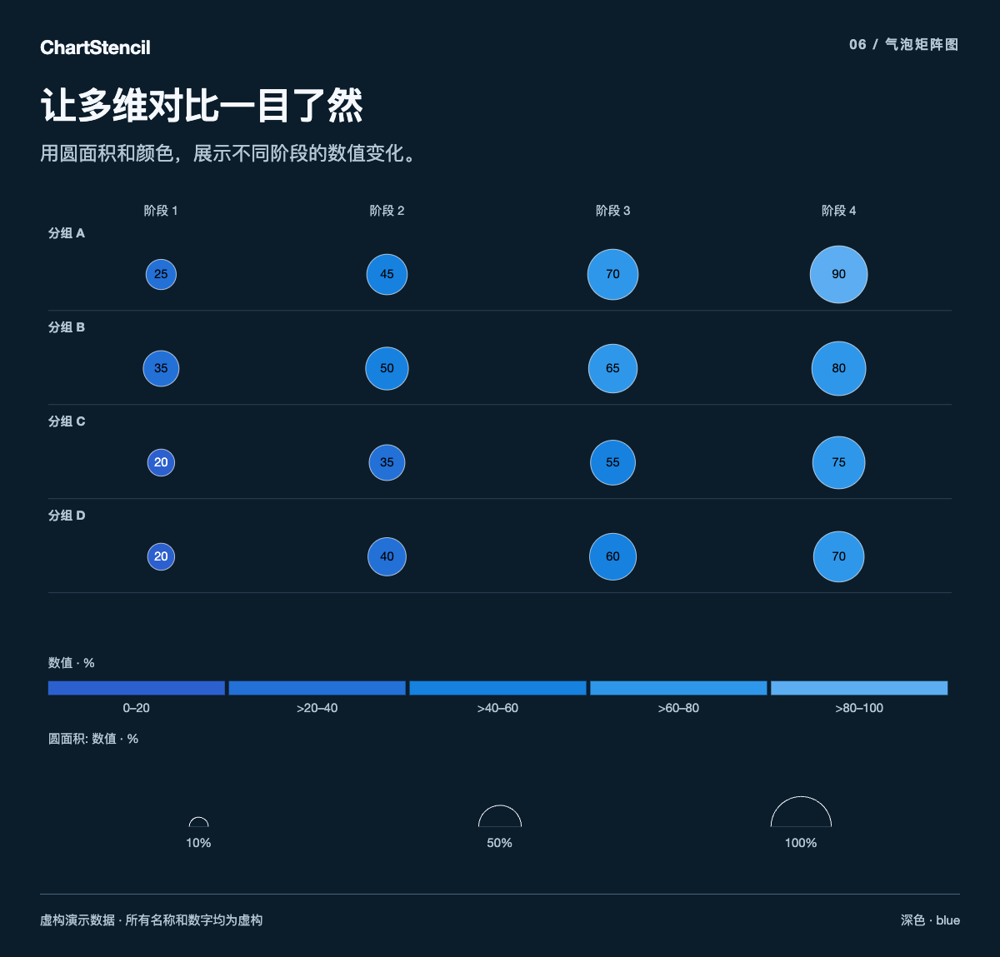
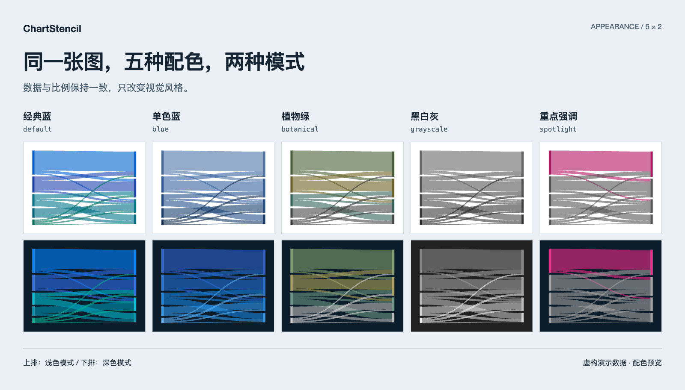

<div align="center">

# ChartStencil

### 让你的数据，成为清晰、专业的图表。

可复用的图表 Skill 与本地绘图工具。<br>
提供数据与文字，选好图型，生成可以继续编辑的作品。

[English](README.md) · **简体中文**

[下载工具](https://github.com/leoshenzh/chartstencil/releases/latest) · [快速开始](#快速开始) · [图表画廊](#图表画廊) · [全部 119 种图型](references/chart-catalog.md)

**119 种图型 · 5 种配色 · 深浅模式 · 离线 HTML · 可编辑 SVG**

</div>

[](docs/images/sankey-zh.png)

**桑基流向图** — 用带宽表达数量，让每一条流向都清清楚楚。

> 本页所有展示图均使用**虚构名称和演示数据**，用于展示绘图效果，不是真实数据集或业务报告。点击图片可查看原尺寸。

## 为什么做 ChartStencil

AI 已经很擅长写分析，但把一组数据画得清楚、专业，仍然需要选对图型、统一样式，再把它可靠地渲染出来。ChartStencil 把这些可复用的部分整理成了工具。

| 选对图型 | 调好风格 | 带走成品 |
| --- | --- | --- |
| **119 种图型**，覆盖流向、排名、构成、对比、分布、网络和时间序列。 | **五种配色、深浅模式**，支持传入名称、单位和自定义品牌色。 | 生成可交互的**独立 HTML**，并导出可继续编辑的 **SVG**。 |

工具提供图表模板与绘制能力。数字、文字、来源和结论由使用者提供；没有填写的标题和说明保持留空。

## 图表画廊

这里精选六种图型。上方的桑基流向图是第一种，下面是其余五种。

### 02 / 排名彩带图

追踪同一组对象如何改变位置。上下位置表示排名，圆面积表示数量，彩带连接同一个对象。

[](docs/images/ribbons-zh.png)

### 03 / 分层面积图

把整体和细分放在同一张图里。外层区分分组，内层呈现细项，面积表达数量。

[](docs/images/nested-voronoi-zh.png)

### 04 / 变宽构成图

同时看清规模和内部构成。列宽表示总量，列内高度表示占比。

[](docs/images/mekko-zh.png)

### 05 / 点阵分流图

让一个总数变得具体。每个点代表一个单位，连线展示它流向哪个去向。

[](docs/images/unit-flow-zh.png)

### 06 / 气泡矩阵图

在多个分组、多个阶段之间快速对比。用圆面积和颜色两种视觉通道展示数值。

[](docs/images/bubble-matrix-zh.png)

[查看完整图型目录 →](references/chart-catalog.md)

## 五种配色，两种模式

切换风格不会改变数据。下面用同一张桑基图展示全部十种组合：**上排为浅色，下排为深色**。

[](docs/images/palettes-zh.png)

| 配色 | 命令参数 | 视觉特点 |
| --- | --- | --- |
| 经典蓝 | `default` | 蓝、青、绿与洋红组成的分类色 |
| 单色蓝 | `blue` | 克制的蓝色序列 |
| 植物绿 | `botanical` | 绿色搭配橄榄色 |
| 黑白灰 | `grayscale` | 中性色调 |
| 重点强调 | `spotlight` | 用强调色突出部分分类，其余保持中性 |

主题参数为 `dark`、`light`。自定义品牌色使用六位十六进制色值，程序会调整对比度。部分图型根据数值顺序或语义使用自己的颜色编码。生成的网页带有配色与主题控件，并记住读者选择的深浅模式。

## 快速开始

**需要 Python 3.8+ 和现代浏览器。** 无需安装 Python 依赖；D3 已随包提供，生成的图表可离线打开。

### 1. 下载工具

下载并解压 [chartstencil-v0.1.0.zip](https://github.com/leoshenzh/chartstencil/releases/download/v0.1.0/chartstencil-v0.1.0.zip)，在解压后的文件夹中打开终端。

发行压缩包只包含工具；本仓库另有用于说明效果的虚构数据配图。

### 2. 选择图型，准备自己的数据

```sh
python3 scripts/build.py --list
```

根据所选图型的[字段约定](references/catalog.json)和[输入格式说明](references/data-format.md)，准备自己的 JSON 文件。

- 必填字段：`type`、`data`。
- 可选文字：`title`、`subtitle`、`description`、`source`、`footnote`。
- 名称、指标、单位与标注由输入决定。
- 每种图型有各自的结构要求，并非任意数据都适合任意图型。

### 3. 生成图表

```sh
python3 scripts/build.py \
  --input your-data.json \
  --out out \
  --theme dark \
  --palette default
```

用浏览器打开生成的 HTML，即可查看数值、切换主题和配色、重播动画，并导出 SVG。

SVG 导出包含**图形本身**，不包含网页外围的标题和来源文字。保留完整图卡，可以保存 HTML 或使用浏览器截图。

### 作为 AI Skill 使用

按照所用工具的安装说明，让支持本地 Skill 的 AI 助手加载**整个工具文件夹**。[SKILL.md](SKILL.md) 是入口，`assets/`、`references/`、`scripts/` 和 `vendor/` 都需保留。

Skill 根据已有内容选择、套用图表模板，不编造业务数据、分析结论或来源。

### 中英文文字

双语字段采用两个元素的数组：中文在前，英文在后。加上 `--lang en` 可选择英文项；这是选择你已提供的文字，不会自动翻译。v0.1.0 网页操作控件仍为中文。

## 工具里有什么

| 内容 | 用途 |
| --- | --- |
| [SKILL.md](SKILL.md) | 给 AI 助手的使用规则 |
| [图型目录](references/chart-catalog.md) | 全部 119 种图型及对应实现 |
| [字段约定](references/catalog.json) | 数据结构和约束 |
| [输入格式说明](references/data-format.md) | 输入规范 |
| [构建脚本](scripts/build.py) | 将 JSON 生成独立 HTML |
| [图表模块](assets/charts) | 可复用的图型实现 |
| [版本说明](RELEASE.md) | 已完成的验证及其边界 |

工具不包含地理地图、业务数据集、预设分析、报告/PPT 工作流或私有系统接入。文档配图只展示支持的图型效果，不附带原始演示数据集。

## 许可与署名

采用 **MIT 许可**，见 [LICENSE](LICENSE) 和 [NOTICE.md](NOTICE.md)。D3 使用 [ISC 许可](vendor/d3/LICENSE)。上游版权声明均予以保留。

ChartStencil 是独立项目，与任何咨询公司无关联，也未获得其认证。

<div align="center">

**选好图型，填入数据，把关系讲清楚。**

[下载 ChartStencil](https://github.com/leoshenzh/chartstencil/releases/latest) · [阅读英文说明](README.md)

</div>
